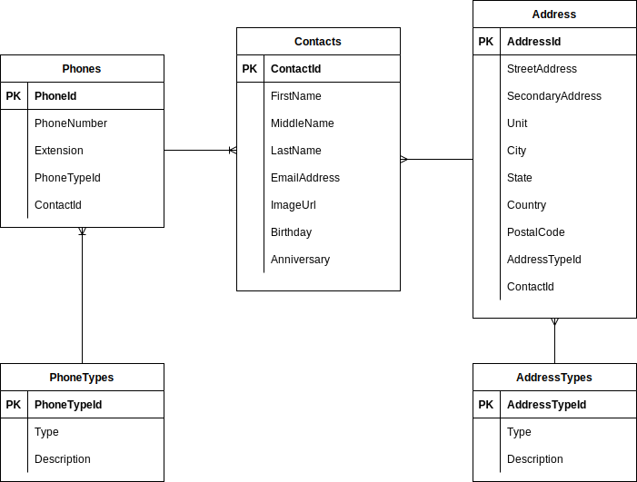
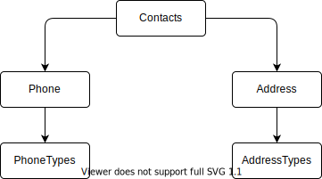
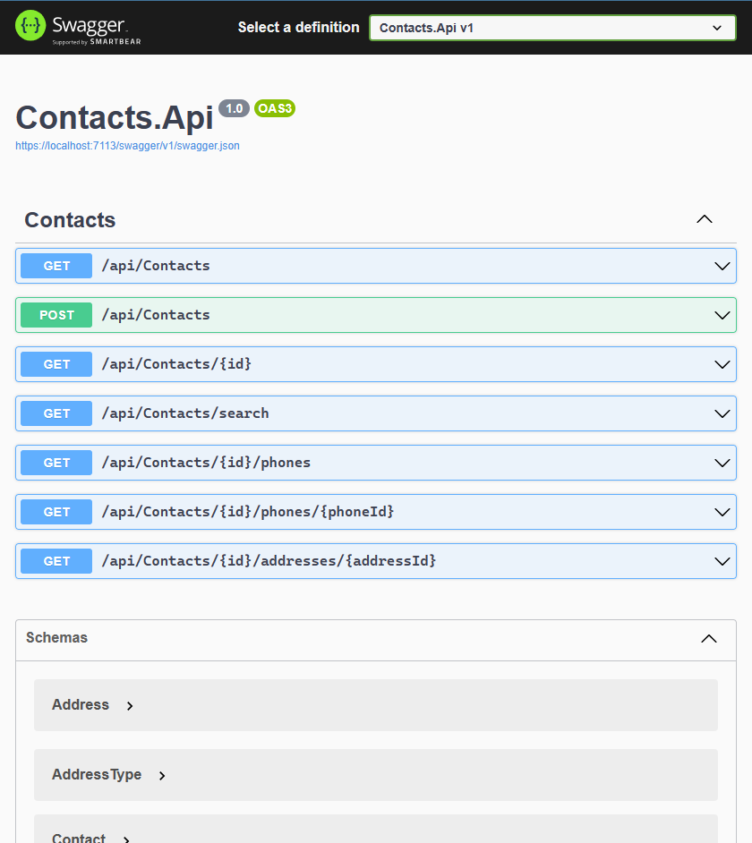
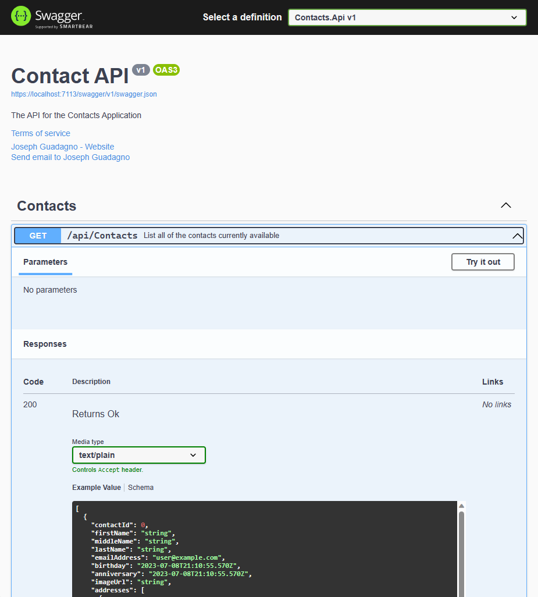

# Workshop Instructions

Please make sure you have completed the [prerequisites](../readme.md) before starting this workshop.

For this workshop, you will be creating a REST API based on an existing database.  The database is a simple contact database with the primary table called `Contacts`.  



## The Solution

Expand the `Contacts.Domain` class, then the `Interfaces` and `Models` folders.  There are the interfaces and models for the project that you will working with.

### Contacts.Domain.Interfaces

| Interface | Description |
| --------- | ----------- |
| `IContactDataStore` | Interface for the Contact Data Store |
| `IContactManager` | Interface for the Contact Manager |
| `IContactRepository` | Interface for the Contact Repository |

You will be using the `IContactManager` interface to implement the API. The other two interfaces are used for interacting with the database.

### Contacts.Domain.Models

| Model | Description |
| ----- | ----------- |
| `Address` | Model for the Address |
| `AddressType` | Model for the Address Type |
| `Contact` | Model for the Contact |
| `Phone` | Model for the Phone |
| `PhoneType` | Model for the Phone Type |

We will be using all of these models in the API. The primary focus, however, will be on the `Contact` model.



### Contact.Data

Contains the implementation of the `IContactRepository` interface.  This is the class that will be used to provide a common set of methods for interacting with a Data Store. Because of the way this application is designed, you use many data stores, like SQL Server, Oracle, SQLite, MySQL, etc.

### Contacts.Data.Sqlite

Contains the implementation of `IContactDataStore` interface.  This is the class that will be used to provide the data for *Contacts* through a SQLite database.

### Contacts.Logic

This is the main class that you will be using for building the API. The `ContactManager` class implements the `IContactManager` interface.  The class has methods for creating, deleting, updating, and retrieving contacts.

## Creating the API

* Right-click on the Solution and select **Add** -> **New Project...**
* In the **Add New Project** dialog, select **ASP.NET Core Web API** and click **Next**. If it is not available, make sure you have the latest version of the .NET SDK installed.
* Enter a name for the project, like `Contacts.Api`. The default location should be fine. Click **Create**.

For the options, choose the following:

| Option | Value |
| ------ | ----- |
| Framework | .NET 7.0 |
| Authentication Type | None |
| Configure for HTTPS | *checked* |
| Enable Docker | *unchecked* |
| Use controllers | *checked* |
| Enable OpenAPI support | *checked* |
| Do not use top-level statements | *unchecked* |

* Click **Create**.

After the project is created, let's get rid of the *WeatherForecast* stuff.  Delete the following files:

* `Controllers/WeatherForecastController.cs`
* `WeatherForecast.cs`

Now we are ready to start building the API.

### Add required references

In order to work with the existing *Contacts* code, we need to add references to the `Contacts.Domain`, `Contacts.Data`, `Contacts.Data.Sqlite`, and `Contacts.Logic` projects.

* Right-click on the **Dependencies** node in the **Contacts.Api** project and select **Add Project Reference...**
* Check the boxes for the following projects:
  * `Contacts.Data`
  * `Contacts.Data.Sqlite`
  * `Contacts.Domain`
  * `Contacts.Logic`
* Click **OK**
  
### Register the Application Services

* Open the `Program.cs` file in the **Contacts.Api** project.
* Look for the comment `// Add services to the container.`, around line 3. After that comment add the following code:

```csharp
builder.Services.AddTransient<IContactRepository, ContactRepository>();
builder.Services.AddTransient<IContactManager, ContactManager>();
builder.Services.AddTransient<IContactDataStore, Contacts.Data.Sqlite.SqliteDataStore>();
```

You just told the ASP.NET Core runtime where is can find the implementations of the interfaces that you will be using in the API.

### Application Configuration

Because we are using a database we need to tell the application where to find the database.  We will do this using the `appsettings.json` or `appsettings.Development.json` file. If you open up the `Contacts.Data.Sqlite\ContactContext.cs` file, you will see that it requires a `IConfiguration` to be passed to it when we construct the class.  You'll also see, on line 23, that it is looking for a connection string named `ContactsDataSqlite`.  We will add that to the `appsettings.json` file.

* Open the `appsettings.Development.json` file in the **Contacts.Api** project. ***NOTE*** We are using the *Development* version of the file because we are running the application locally.  When the application is deployed, you would use the `appsettings.json` file.
* After the first line add the following code:

```json
"ConnectionStrings": {
  "ContactsDatabaseSqlite": "Data Source=contacts.db"
},
```

The sample database is stored in the [./src/database/contacts.db](./src/database/contacts.db) file.

***NOTE*** The `Data Source=contacts.db` tells the application to look for a SQLite database named `contacts.db` in the root of the application.  You can copy the file there now, or enter the fully qualified path to the database.

Now we need to register the `IConfiguration` interface with the application.

* Open the `Program.cs` file in the **Contacts.Api** project.
* Below the line `builder.Services.AddTransient<IContactDataStore, Contacts.Data.Sqlite.SqliteDataStore>();` add the following code:

```csharp
builder.Services.AddTransient<IConfiguration>(_sp_ => builder.Configuration);
```

* Build the solution to make sure we got everything right so far. Choose **Build** -> **Build Solution** from the menu.

### Create the API Controller

* Right-click on the **Controllers** folder in the **Contacts.Api** project and select **Add** -> **New Scaffolded Item...**, choose **API Controller - Empty** and click **Add**.
* Change the name to `ContactsController.cs`

Now we need to inject the `ContactsManager` into the controller.

After the class declaration, `public class ContactsController : ControllerBase`, and before the `// GET: api/<ContactsController>` add a constructor with the following code:

```csharp
public ContactsController(IContactManager contactManager)
{
    _contactManager = contactManager;
}
```

The variable `_contactManager` is a private variable that will be used to access the `IContactManager` interface. It should have a red squiggly line under it.  That is because we haven't declared it yet.  Let's do that now.

Above the constructor add the following code:

```csharp
private readonly IContactManager _contactManager;
```

Now we need to add the methods for the API.  We will start with the `Get` method.

Modify the `Get` method to look like the following:

```csharp
[HttpGet]
public async Task<ActionResult<IEnumerable<Contact>>> GetContacts()
{
    return await _contactManager.GetContactsAsync();
}
```

The `Contact` parameter now has a red squiggly line under it. That is because we haven't told the application where to find the `Contact` model.  Let's do that now.

At the top of the file add the following code:

```csharp
using Contacts.Domain.Models;
```

Let's take a look at what we just did for this method.  We created a method called `GetContacts` that returns a `Task<ActionResult<IEnumerable<Contact>>>`.  This is a standard way of returning data from an API.  The `Task` part of the return type tells the application that this method is asynchronous.  The `ActionResult` part of the return type tells the application that this method will return an HTTP response.  The `IEnumerable<Contact>` part of the return type tells the application that this method will return a collection of `Contact` objects.

* Build the solution to make sure we got everything right so far. Choose **Build** -> **Build Solution** from the menu.

Let's run the API to make sure we have everything wired up correct.

* Right-click on the **Contacts.Api** project and select **Set as Startup Project**.
* Press **F5** to run the application or choose **Debug** -> **Start Debugging** from the menu.

In a few seconds, a new browser window should appear with a UI like `https://localhost:7113/swagger/index.html`. The port number may be different.  If you don't see the Swagger UI, you can navigate to `https://localhost:<port>/swagger/index.html` in your browser.

Click the **Get** button and then click the **Try it out** button, then click the **Execute** button.  You should see a list of contacts in the **Response body** section.

You should see the first record look something like this:

```json
{
    "contactId": 1,
    "firstName": "Eugene",
    "middleName": "Leonardo",
    "lastName": "Jimenez",
    "emailAddress": "vqrho.fdxkenwo@rwps.inozb.com",
    "birthday": "2001-08-10T17:00:00-07:00",
    "anniversary": "2002-02-18T17:00:00-07:00",
    "imageUrl": null,
    "addresses": [],
    "phones": [],
    "fullName": "Eugene Leonardo Jimenez"
  }
```

Stop the Application by clicking the **Stop Debugging** button in Visual Studio.

#### Add the remaining methods

##### Get Contact by Id

Create the `GetContact` method.  This will all you to get a single contact by its Id.

```csharp
[HttpGet("{id}")]
public async Task<ActionResult<Contact>> GetContact(int id)
{
    var contact = await _contactManager.GetContactAsync(id);
    if (contact is not null)
    {
        return contact;
    }
    return NotFound();
}
```

If the contact is found, it will return the contact.  If the contact is not found, it will return a `NotFound` (404) response.

##### Create Contact

The `SaveContact` will be used to create a new contact. Let's create it.


```csharp
[HttpPost]
public async Task<ActionResult<Contact>> SaveContact(Contact contact)
{
    var savedContact = await _contactManager.SaveContactAsync(contact);

    if (savedContact != null)
    {
        return CreatedAtAction(nameof(GetContactAsync),
            new { id = contact.ContactId },
            contact);
    }

    return Problem("Failed to insert the contact");
}
```

The method is a little different from the others.  It returns a `CreatedAtAction` (201) response.  This is the standard response for a successful create operation which will return the URL to view the newly created contact. If the contact is not created, it returns a `Problem` (500) response.

##### Update Contact

We are going to skip this one since the code is very similar to the `SaveContact` method.  You can add it if you want.

##### Delete Contact

The `DeleteContact` method will be used to delete a contact.

```csharp
[HttpDelete("{id}")]
public async Task<ActionResult<bool>> DeleteContact(int id)
{
    var wasDeleted = await _contactManager.DeleteContactAsync(id);
    if (wasDeleted)
    {
        return NoContent();
    }
    else
    {
        return NotFound();
    }
}
```

##### Search Contact

The `ContactManager` class has an overload of the `GetContactsAsync` method that allows you to search for contacts by `FirstName` and `LastName`.  We will use that method to create the `SearchContacts` method.

```csharp
[HttpGet("search")]
public async Task<List<Contact>> GetContacts([FromQuery] string firstName, [FromQuery] string lastName)
{
    return await _contactManager.GetContactsAsync(firstName, lastName);
}
```

Here we added a few new things.  First, we added the text of `search` to the `HttpGet` attribute.  This tells ASP.NET Core routing then when you see a URL in the Contact routing that ends matches `search` to call this method.  The URL would look something like `https://localhost:7113/api/contacts/search`.  

The `FromQuery` attribute tells ASP.NET Core to look for the parameters for `firstName` and `lastName` in the query string of the URL. That means that the URL would look something like `https://localhost:7113/api/contacts/search?firstName=Joseph&lastName=Guadagno`.

##### Address and Phone Methods

To demonstrate how you can have methods that return data from other tables while extending the URLs, we will add the following methods:

###### Get Phones for a given Contact

```csharp
[HttpGet("{id}/phones")]
public async Task<List<Phone>> GetContactPhones(int id)
{
    return await _contactManager.GetContactPhonesAsync(id);
}
```

The URL would look like this: `https://localhost:7113/api/contacts/1/phones`. This method will return all the phones for the contact with the identifier of 1. If one was not found, a `NotFound` (404) response will be returned.

###### Get a single Phone with an identifier for a given Contact

```csharp
[HttpGet("{id}/phones/{phoneId}")]
public async Task<ActionResult<Phone>> GetContactPhone(int id, int phoneId)
{
    var phone = await _contactManager.GetContactPhoneAsync(id, phoneId);
    if (phone is not null)
    {
        return phone;
    }

    return NotFound();
}
```

The URL would look like this: `https://localhost:7113/api/contacts/1/phones/1`. This method will return the phones with the identifier of 1 for the contact with the identifier of 1. If one was not found, a `NotFound` (404) response will be returned.

###### Get Addresses for a given Contact

```csharp
[HttpGet("{id}/addresses")]
public async Task<List<Address>> GetContactAddress(int id)
{
    return await _contactManager.GetContactAddressesAsync(id);
}
```

The URL would look like this: `https://localhost:7113/api/contacts/1/addresses`. This method will return all the addresses for the contact with the identifier of 1. If one was not found, a `NotFound` (404) response will be returned.

###### Get a single Address with an identifier for a given Contact

```csharp
[HttpGet("{id}/addresses/{addressId}")]
public async Task<ActionResult<Address>> GetContactAddresses(int id, int addressId)
{
    var address = await _contactManager.GetContactAddressAsync(id, addressId);
    if (address is not null)
    {
        return address;
    }

    return NotFound();
}
```

The URL would look like this: `https://localhost:7113/api/contacts/1/addresses/1`. This method will return the address with the identifier of 1 for the contact with the identifier of 1. If one was not found, a `NotFound` (404) response will be returned.

### Test the API

* Press **F5** to run the application or choose **Debug** -> **Start Debugging** from the menu.

The Swagger UI should open up, and you should see the new methods. Feel free to test them out.



Stop the project by clicking the **Stop Debugging** button in Visual Studio.

## Document the API

Now that we have the API working, let's add some documentation to it.  We will use the [Swashbuckle.AspNetCore](https://github.com/domaindrivendev/Swashbuckle.AspNetCore)

### Program.cs

* Right-click on the **Contacts.Api** project and select **Properties**
* Expand the **Build** tab, select **Output**, find the **Documentation file** settings, and check the **Generate a file containing API documentation** checkbox.
* Save the changes and close the **Properties** window.
* Open up the `Program.cs` file in the **Contacts.Api** project.
* Find line `builder.Services.AddSwaggerGen();` (around line 16) and change it to

```csharp
builder.Services.AddSwaggerGen(c =>
{
    c.SwaggerDoc("v1",
        new OpenApiInfo
        {
            Title = "Contact API", 
            Version = "v1",
            Description = "The API for the Contacts Application",
            TermsOfService = new Uri("https://example.com/terms"),
            Contact = new OpenApiContact
            {
                Name = "Joseph Guadagno",
                Email = "jguadagno@hotmail.com",
                Url = new Uri("https://www.josephguadagno.net"),
            }
        });
                
    // Set the comments path for the Swagger JSON and UI.
    var xmlFile = $"{Assembly.GetExecutingAssembly().GetName().Name}.xml";
    var xmlPath = Path.Combine(AppContext.BaseDirectory, xmlFile);
    c.IncludeXmlComments(xmlPath);
});
```

Feel free to change the values for the `Contact` property. :)

### ContactsController.cs

* Open the `ContactsController.cs` file in the **Contacts.Api** project.
* Add the following to the `GetContacts` method before the `[HttpGet]` attribute:


```csharp
/// <summary>
/// List all of the contacts currently available
/// </summary>
/// <returns>A List of <see cref="Contact"/></returns>
/// <response code="200">Returns Ok</response>
/// <response code="400">If requests is poorly formatted</response>            
[ProducesResponseType(StatusCodes.Status200OK)]
[ProducesResponseType(StatusCodes.Status400BadRequest)]
```

Run the application and navigate to the Swagger UI.  You should see the documentation for the `GetContacts` method, and it should look like this:



### Add the remaining documentation

#### GetContact

```csharp
/// <summary>
/// Gets a specific contact from the contact manager
/// </summary>
/// <param name="id">The primary identifier of the contact</param>
/// <returns>A <see cref="Contact"/></returns>
/// <response code="200">Ok</response>
/// <response code="400">If the request is poorly formatted</response>            
[ProducesResponseType(StatusCodes.Status200OK)]
[ProducesResponseType(StatusCodes.Status400BadRequest)]
```

#### SaveContact

```csharp
/// <summary>
/// Adds a contact to the contact manager
/// </summary>
/// <param name="contact">A contact</param>
/// <returns>The contact with the Url to view its details</returns>
/// <response code="201">Returns the newly created item</response>
/// <response code="400">If the item is null or there are data violations</response>            
[ProducesResponseType(StatusCodes.Status201Created)]
[ProducesResponseType(StatusCodes.Status400BadRequest)]
```

#### DeleteContact

```csharp
/// <summary>
/// Deletes the specified contact
/// </summary>
/// <param name="id">The primary identifier for the contact</param>
/// <returns></returns>
/// <response code="200">If the item was deleted</response>
/// <response code="400">If the request is poorly formatted</response>            
[ProducesResponseType(StatusCodes.Status200OK)]
[ProducesResponseType(StatusCodes.Status400BadRequest)]
```

#### SearchContacts (GetContacts(firstName, lastName))

```csharp
/// <summary>
/// Searches for a contact
/// </summary>
/// <param name="firstName">The first name of the contact to search for</param>
/// <param name="lastName">The last name of the contact to search for</param>
/// <returns>A list of 0 or more contacts that meet the criteria</returns>
/// <response code="200">Ok</response>
/// <response code="400">If the request is poorly formatted</response>            
[ProducesResponseType(StatusCodes.Status200OK)]
[ProducesResponseType(StatusCodes.Status400BadRequest)]
```

#### GetContactPhones

```csharp
/// <summary>
/// Gets phone numbers for the contact
/// </summary>
/// <param name="id">The primary identifier of the contact</param>
/// <returns>A list of <see cref="Phone"/></returns>
/// <response code="200">Ok</response>
/// <response code="400">If the request is poorly formatted</response>    
[ProducesResponseType(StatusCodes.Status200OK)]
[ProducesResponseType(StatusCodes.Status400BadRequest)]
```

#### GetContactPhone

```csharp
/// <summary>
/// Gets a specific phone for the specified contact
/// </summary>
/// <param name="id">The primary identifier of the contact</param>
/// <param name="phoneId">The primary identifier of the phone number</param>
/// <returns>A <see cref="Contact"/></returns>
/// <response code="200">Ok</response>
/// <response code="400">If the request is poorly formatted</response>    
/// <response code="404">If a phone was not found for that <paramref name="id"/> or <paramref name="addressId"/></response>
[ProducesResponseType(StatusCodes.Status200OK)]
[ProducesResponseType(StatusCodes.Status400BadRequest)]
[ProducesResponseType(StatusCodes.Status404NotFound)]
```

#### GetContactAddresses

```csharp
/// <summary>
/// Gets addresses for the contact
/// </summary>
/// <param name="id">The primary identifier of the contact</param>
/// <returns>A list of <see cref="Address"/>es</returns>
/// <response code="200">Ok</response>
/// <response code="400">If the request is poorly formatted</response>    
/// <response code="404">If a contact was not found for that <paramref name="id"/></response>
[ProducesResponseType(StatusCodes.Status200OK)]
[ProducesResponseType(StatusCodes.Status400BadRequest)]
```

#### GetContactAddress

```csharp
/// <summary>
/// Gets a specific address for a specific contact
/// </summary>
/// <param name="id">The primary identifier of the contact</param>
/// <param name="addressId">The primary identifier of the address</param>
/// <returns>A <see cref="Contact"/></returns>
/// <response code="200">Ok</response>
/// <response code="400">If the request is poorly formatted</response>   
/// <response code="404">If an address was not found for that <paramref name="id"/> or <paramref name="addressId"/></response>
[ProducesResponseType(StatusCodes.Status200OK)]
[ProducesResponseType(StatusCodes.Status400BadRequest)]
[ProducesResponseType(StatusCodes.Status404NotFound)]
[HttpGet("{id}/addresses/{addressId}")]
```

### Documentation Complete

At this point, your API should be done and ready to be used.  You can run the application and test it out.

If you struggled and could not complete it, you can find the completed code in the [/complete](../../complete/) folder.
